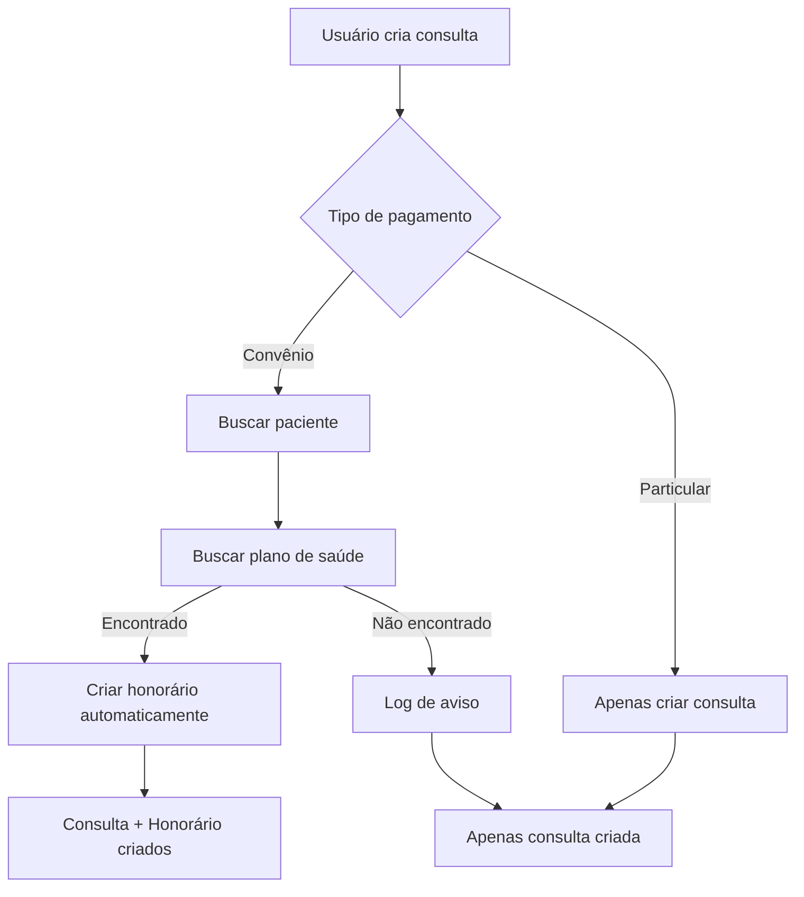

# Criação Automática de Honorários 🚀

## Visão Geral

Foi implementada a funcionalidade de **criação automática de honorários** quando uma nova consulta é registrada por convênio, eliminando a necessidade de criar honorários manualmente.

## 🎯 Como Funciona

### 1. Nova Função no DataContext

**Função:** `addConsultaComHonorario`

**Localização:** `src/contexts/DataContext.tsx`

```typescript
const addConsultaComHonorario = (consulta: Omit<Consulta, 'id'>) => {
  // 1. Cria a consulta normalmente
  const novaConsulta = { ...consulta, id: getNextId(consultas) };
  setConsultas(prev => [...prev, novaConsulta]);

  // 2. Se for por convênio, cria honorário automaticamente
  if (consulta.tipoPagamento === 'convenio') {
    // Busca paciente e plano de saúde
    // Calcula vencimento (30 dias)
    // Cria honorário com status PENDENTE
  }
};
```

### 2. Lógica de Mapeamento

A função automaticamente:
- **Identifica o paciente** pela `pacienteId`
- **Busca o plano de saúde** pelo nome do convênio do paciente
- **Calcula vencimento** em 30 dias após a consulta
- **Define valor** igual ao valor do procedimento
- **Status inicial** sempre `PENDENTE`

### 3. Integração com RegistroConsultas

**Arquivo:** `src/components/RegistroConsultas.tsx`

**Mudança:**
```typescript
// Antes
addConsulta(novaConsulta);

// Agora
addConsultaComHonorario(novaConsulta);
```

## 📋 Regras de Negócio

### ✅ Quando o Honorário É Criado Automaticamente

- **Tipo de Pagamento:** Convênio
- **Plano de Saúde:** Encontrado nos dados
- **Paciente:** Existe e tem convênio cadastrado

### ⚠️ Quando o Honorário NÃO É Criado

- **Tipo de Pagamento:** Particular
- **Plano não encontrado:** Convênio não mapeado
- **Paciente não encontrado:** ID inválido

### 🎯 Dados do Honorário Criado

| Campo | Valor |
|-------|-------|
| `medicoId` | ID do médico da consulta |
| `consultaId` | ID da consulta criada |
| `planoSaudeId` | ID do plano encontrado |
| `dataConsulta` | Data da consulta |
| `valor` | Valor do procedimento |
| `status` | `PENDENTE` |
| `motivo` | `"Honorário automático da consulta [PROTOCOLO]"` |

## 🗂️ Mapeamento de Convênios

Os seguintes convênios são mapeados automaticamente:

| Convênio do Paciente | Plano de Saúde Mapeado |
|---------------------|------------------------|
| Bradesco Saúde | Bradesco Saúde (ID: 2) |
| Amil | Amil (ID: 3) |
| SulAmérica | SulAmérica Saúde (ID: 5) |

## 🔄 Fluxo Completo



## 💡 Benefícios

### ✅ Eficiência
- **Elimina trabalho duplo** de criar consulta e honorário
- **Reduz tempo** de cadastro por operador

### ✅ Consistência
- **Dados sincronizados** automaticamente
- **Padronização** de vencimentos (30 dias)
- **Redução de erros** manuais

### ✅ Rastreabilidade
- **Logs no console** para auditoria
- **Vinculação direta** consulta ↔ honorário
- **Histórico completo** de criação

### ✅ Flexibilidade
- **Função original** `addConsulta` mantida
- **Casos especiais** podem usar criação manual
- **Fácil manutenção** e extensão

## 🧪 Como Testar

### 1. Criar Consulta por Convênio

1. Ir em **"Registro de Consultas"**
2. Clicar **"+ Nova Consulta"**
3. Selecionar paciente com convênio (ex: Daniel Torres - Bradesco Saúde)
4. Selecionar **"Convênio"** como tipo de pagamento
5. Preencher demais campos e salvar

**Resultado esperado:**
- ✅ Consulta criada
- ✅ Honorário criado automaticamente
- ✅ Log no console: `"✅ Honorário criado automaticamente..."`

### 2. Verificar Honorário

1. Ir em **"Gestão de Honorários"**
2. Verificar novo honorário com:
   - Status: PENDENTE
   - Valor igual ao da consulta
   - Vencimento em 30 dias

### 3. Criar Consulta Particular

1. Selecionar **"Particular"** como tipo de pagamento
2. Salvar consulta

**Resultado esperado:**
- ✅ Apenas consulta criada
- ❌ Nenhum honorário criado
- ℹ️ Log: `"Consulta particular criada - honorário não gerado..."`

## 🔧 Logs e Debugging

### Console Logs

```
✅ Honorário criado automaticamente para consulta PROTO-008
⚠️ Plano de saúde não encontrado para o convênio: Convênio XYZ
ℹ️ Consulta particular criada - honorário não gerado automaticamente
```

### DevTools

Para verificar o estado:
```javascript
// No console do navegador
localStorage.getItem('sghm-data') // Se persistência implementada
```

## 🚀 Próximas Melhorias

### 📈 Funcionalidades Futuras
- [ ] **Configuração de vencimento** (hoje: fixo 30 dias)
- [ ] **Múltiplos honorários** por consulta
- [ ] **Cálculo automático** de valores por especialidade
- [ ] **Integração com APIs** de planos de saúde
- [ ] **Notificações** de honorários criados

### 🔒 Validações Adicionais
- [ ] **Verificar duplicatas** antes de criar
- [ ] **Validar datas** de vencimento
- [ ] **Conferir limites** de valor por plano

---

**Implementação concluída com sucesso!** ✨

A funcionalidade está ativa e pronta para uso no branch `frontend-dev`.