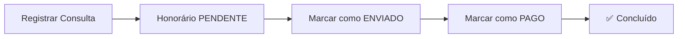
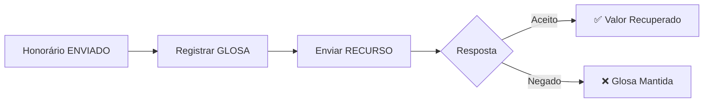

# 🚀 Guia Rápido - SGHM

## ⚡ Início Rápido em 5 Minutos

### 1️⃣ Fazer Login
```
📧 Email: seu-email@exemplo.com
🔑 Senha: sua-senha
```

### 2️⃣ Cadastrar um Médico
```
Menu → Médicos → Novo Médico
✅ Nome, CRM, Especialidade
```

### 3️⃣ Cadastrar um Paciente
```
Menu → Pacientes → Novo Paciente
✅ Nome, CPF, Telefone
```

### 4️⃣ Cadastrar um Plano
```
Menu → Planos → Novo Plano
✅ Nome, Tipo, Valor
```

### 5️⃣ Registrar uma Consulta
```
Menu → Consultas → Nova Consulta
✅ Médico + Paciente + Plano + Data
💰 Honorário criado automaticamente!
```

---

## 📋 Fluxo Completo de Trabalho

### Fluxo Normal (Sem Glosa)



### Fluxo com Glosa e Recurso



---

## 🎯 Atalhos Úteis

### Ações Rápidas

| Ação | Como Fazer |
|------|------------|
| **Buscar** | Digite na barra de busca 🔍 |
| **Filtrar** | Use os filtros no topo da lista |
| **Selecionar Vários** | Use os checkboxes ☑️ |
| **Editar** | Clique no ícone ✏️ |
| **Excluir** | Clique no ícone 🗑️ |
| **Ver Histórico** | Clique no ícone 🕐 |

### Ações em Lote

1. ☑️ **Selecione** os itens (checkboxes)
2. 🎯 **Escolha** a ação:
   - Marcar como Enviado
   - Marcar como Pago
   - Registrar Glosa
3. ✅ **Confirme** a operação

---

## ⚠️ Dicas Importantes

### ✅ Boas Práticas

- 📝 **Preencha todos os campos** obrigatórios
- 🔍 **Use a busca** para encontrar registros rapidamente
- 📊 **Verifique o dashboard** diariamente
- 💾 **Exporte relatórios** regularmente
- 🕐 **Consulte o histórico** em caso de dúvidas

### ❌ Evite

- ❌ Não cadastre médicos com CRM duplicado
- ❌ Não exclua registros com vínculos
- ❌ Não altere dados sem verificar o histórico
- ❌ Não esqueça de salvar as alterações

---

## 🆘 Resolução Rápida de Problemas

### Não consigo fazer login
✅ Verifique email e senha  
✅ Use "Esqueci minha senha"  
✅ Entre em contato com o admin

### Não consigo cadastrar médico
✅ Verifique se o CRM já existe  
✅ Preencha todos os campos obrigatórios  
✅ Verifique sua conexão

### Honorário não aparece
✅ Verifique se a consulta foi salva  
✅ Atualize a página (F5)  
✅ Verifique os filtros ativos

### Não consigo enviar recurso
✅ Verifique se o honorário está GLOSADO  
✅ Preencha o motivo do recurso  
✅ Informe a data do recurso

---

## 📞 Precisa de Ajuda?

**Consulte o Manual Completo:** `MANUAL_DE_USO.md`

**Suporte:**
- 📧 suporte@sghm.com
- 📱 (11) 99999-9999
- 🌐 www.sghm.com.br

---

**Versão:** 1.0  
**Atualizado:** Dezembro 2024
