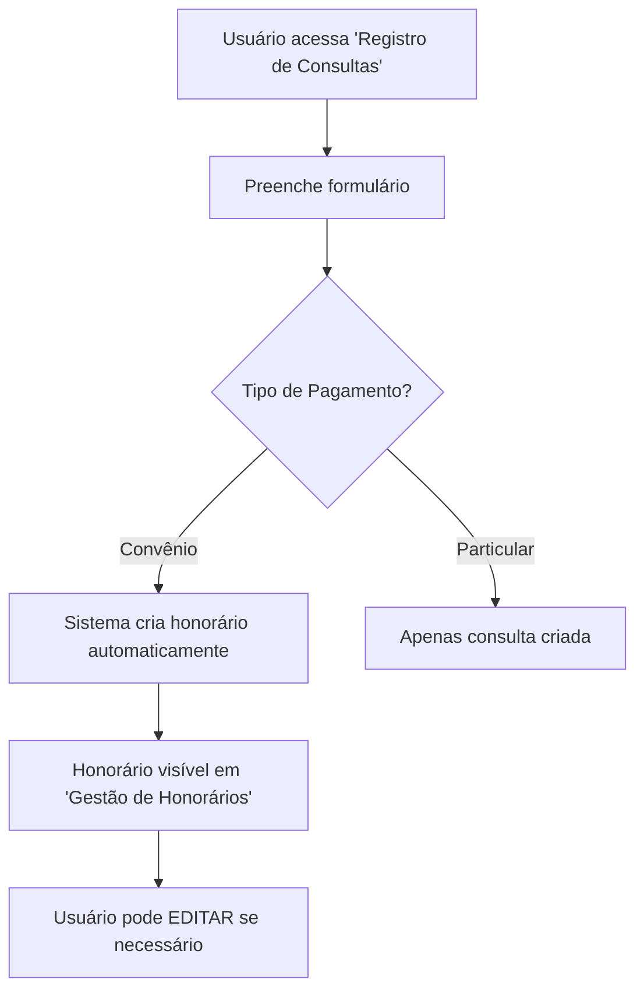
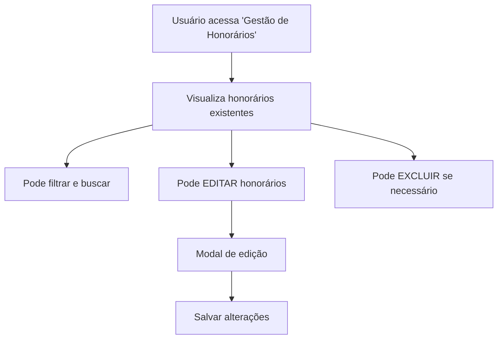

# Remoção do Botão "Novo Honorário" 🚫

## Contexto da Mudança

Com a implementação da **criação automática de honorários** quando consultas por convênio são registradas, o botão "Novo Honorário" se tornou redundante e potencialmente confuso para os usuários.

## 🎯 Problema Identificado

- **Redundância:** Honorários são criados automaticamente
- **Confusão:** Usuários podem tentar criar honorários duplicados
- **Inconsistência:** Duas formas diferentes de criar o mesmo dado
- **UX inadequada:** Interface sugere ação manual desnecessária

## ✅ Mudanças Implementadas

### 1. Remoção do Botão "Novo Honorário"

**Antes:**
```tsx
<button className="btn-primary" onClick={handleNovoHonorario}>
  <FaPlus /> Novo Honorário
</button>
```

**Depois:**
```tsx
<div className="header-note">
  <span>💡 Honorários são criados automaticamente ao registrar consultas por convênio</span>
</div>
```

### 2. Simplificação de Funções

**Removido:**
- ✅ `handleNovoHonorario()` - Função de criação manual
- ✅ Lógica de criação no `handleSalvarHonorario()`
- ✅ Estado de "novo" vs "edição" no modal

**Mantido:**
- ✅ `handleEditarHonorario()` - Edição de honorários existentes
- ✅ `handleSalvarHonorario()` - Apenas para edições
- ✅ `handleConfirmarExclusao()` - Exclusão quando necessário

### 3. Interface Atualizada

#### Header da Página:
```
┌─────────────────────────────────────────────────────────────┐
│ Gestão de Honorários Médicos                               │
│ Total: R$ 1550.00    4 honorários                         │
│                                                           │
│ 💡 Honorários são criados automaticamente ao registrar    │
│    consultas por convênio                                 │
└─────────────────────────────────────────────────────────────┘
```

#### Modal Simplificado:
- **Título fixo:** "Editar Honorário"
- **Função única:** Apenas edição de honorários existentes
- **Validação:** Garante que existe um honorário sendo editado

## 🏗️ Arquivos Modificados

### 1. `GestaoHonorarios.tsx`
```typescript
// ❌ Removido
const handleNovoHonorario = () => { ... }

// ✅ Simplificado
const handleSalvarHonorario = () => {
  if (!editingHonorario) {
    alert('Erro: Nenhum honorário sendo editado.');
    return;
  }
  // Apenas lógica de edição
}

// ✅ Interface atualizada
<div className="header-note">
  <span>💡 Honorários são criados automaticamente...</span>
</div>
```

### 2. `GestaoHonorarios.css`
```css
.header-note {
  background: #e7f3ff;
  padding: 8px 12px;
  border-radius: 6px;
  border-left: 3px solid #007bff;
  font-size: 0.85rem;
  color: #495057;
  max-width: 300px;
}
```

## 🎯 Fluxo Atualizado

### Criação de Honorários:


### Gestão de Honorários:


## 💡 Benefícios da Mudança

### ✅ Experiência do Usuário
- **Clareza:** Interface não sugere ações desnecessárias
- **Simplicidade:** Um fluxo único e claro
- **Orientação:** Nota explicativa orienta sobre o processo automático

### ✅ Consistência de Dados
- **Eliminação de duplicatas:** Impossível criar honorários duplicados
- **Sincronização:** Dados sempre alinhados consulta ↔ honorário
- **Integridade:** Relacionamentos mantidos automaticamente

### ✅ Eficiência Operacional
- **Menos cliques:** Usuário não perde tempo com criação manual
- **Menos erros:** Sistema gerencia criação automaticamente
- **Processo otimizado:** Foco na gestão ao invés da criação

## 🔍 Casos de Uso Cobertos

### ✅ Cenários Normais:
1. **Consulta por convênio** → Honorário criado automaticamente
2. **Consulta particular** → Sem honorário (como esperado)
3. **Ajustes necessários** → Editar honorário existente
4. **Cancelamentos** → Excluir honorário

### ✅ Cenários Excepcionais:
1. **Honorário incorreto** → Editar valores/status
2. **Mudança de status** → Atualizar PENDENTE → ENVIADO → PAGO
3. **Glosas** → Atualizar para GLOSADO com motivo

## 📋 Validações Implementadas

```typescript
// Garantia que só edita honorários existentes
if (!editingHonorario) {
  alert('Erro: Nenhum honorário sendo editado.');
  return;
}

// Validação de campos obrigatórios mantida
if (!formData.medicoId || !formData.planoSaudeId || 
    !formData.dataConsulta || !formData.valor) {
  alert('Por favor, preencha todos os campos obrigatórios.');
  return;
}
```

---

**Resultado:** Interface mais limpa, processo mais eficiente e UX consistente! ✨

A página agora reflete corretamente o fluxo automatizado de criação de honorários, eliminando confusões e simplificando a experiência do usuário.